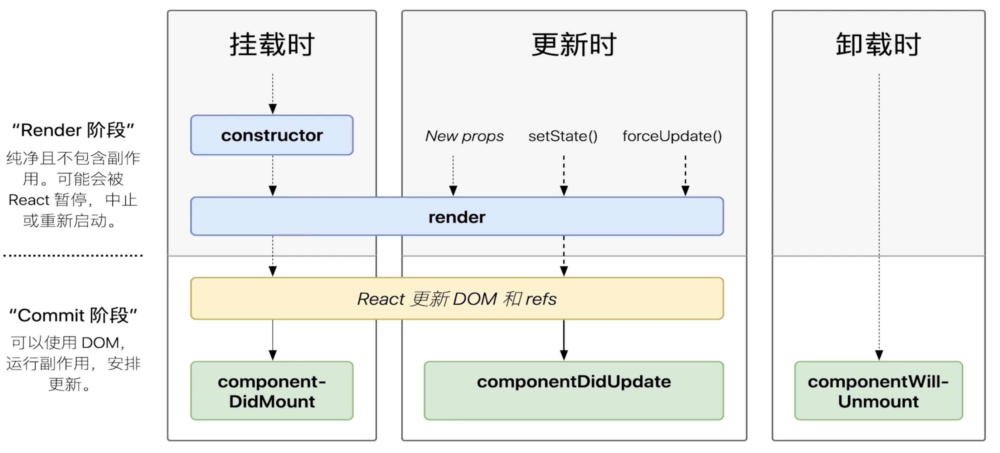

# React


[[toc]]


## React Class

### 事件

:::details

- 事件
  - bind this
  - event 参数
  - 传递自定义参数
  
- **16版本事件绑定在document**
- **17版本事件及以后绑定在root节点**


```js
class Demo extends React.Component {
  handleClick = (event, value) => {
    // event 不是原生event，是组合事件对象
    console.log(event, value);
  };
  // 修改this的指向 不会重复render
  this.handleClickMe = this.handleClickMe.bind(this);
  render() {
    return <>
     <button onClick={this.handleClickMe}>click me</button>
     <button onClick={(e) => this.handleClick(e, "hello")}>click</button>
    </>;
  }
}
```
:::


### React 组件通信

:::details
- 组件
  - props 传递数据
  - props 传递函数
  - props 类型检查

::::

### setState

:::details

- 不可变值
- 可能是异步更新
- 可能会被合并

```js


**不可变值--数组处理**

setState(prevState => {
  return {
    // 追加
    list: [...prevState.list, "new item"]
    // 追加
    list: prevState.list.concat("new item")
    // 截取
    list: prevState.list.slice(0,4)
    // 筛选
    list: prevState.list.filter(item => item > 100)
    // 其他操作 返回一个新的数组
    list: prevState.list.map(item => item + 1)
    // **注意** 不能直接对state进行push pop shift unshift splice 等直接修改数组的操作
  };
}

**不可变值--对象**
setState(prevState => {
  return {
    obj: {...prevState.obj, a: 100}
    obj1: Object.assign({}, prevState.obj1, {a: 100})
  }
})


**异步更新**

this.setState({
  count: this.state.count + 1
}, () => {console.log('callback',  this.state.count)}) // 回调函数 拿到最新的count值

console.log('count--------', this.state.count) // 异步更新，拿不到最新的值


**同步更新**
// setTimeout
setTimeout(() => {
  this.setState({
    count: this.state.count + 1
  })
  console.log("count------------", this.state.count) // 拿到最新值，同步更新
}, 1000)

// 自定义事件
document.getElementById("btn").addEventListener("click", () => {
  this.setState({
    count: this.state.count + 1
  })
  console.log("count------------", this.state.count) // 拿到最新值，同步更新
})

**合并更新**

默认count: 0
this.setState({
  count: this.state.count + 1
})

this.setState({
  count: this.state.count + 1
})
 
 **合并更新结果** 实际为count: 1

**不会合并更新**

this.setState((prevState, props) => {
  return {
    count: prevState.count + 1
  }
})

this.setState((prevState, props) => {
  return {
    count: prevState.count + 1
  }
})

**合并更新结果** 实际为count: 2

```
:::


### React-Class 组件生命周期

[React-Class 组件生命周期](https://projects.wojtekmaj.pl/react-lifecycle-methods-diagram/)



:::details


:::


## 为什么在 React 中不推荐直接修改 state？


:::details
- 调试：如果你使用 console.log 并且不直接修改 state，你之前日志中的 state 的值就不会被新的 state 变化所影响。这样你就可以清楚地看到两次渲染之间 state 的值发生了什么变化
- 优化：React 常见的 优化策略 依赖于如果之前的 props 或者 state 的值和下一次相同就跳过渲染。如果你从未直接修改 state ，那么你就可以很快看到 state 是否发生了变化。如果 prevObj === obj，那么你就可以肯定这个对象内部并没有发生改变。
- 新功能：我们正在构建的 React 的新功能依赖于 state 被 像快照一样看待 的理念。如果你直接修改 state 的历史版本，可能会影响你使用这些新功能。
- 需求变更：有些应用功能在不出现任何修改的情况下会更容易实现，比如实现撤销/恢复、展示修改历史，或是允许用户把表单重置成某个之前的值。这是因为你可以把 state 之前的拷贝保存到内存中，并适时对其进行再次使用。如果一开始就用了直接修改 state 的方式，那么后面要实现这样的功能就会变得非常困难。
- 更简单的实现：React 并不依赖于 mutation ，所以你不需要对对象进行任何特殊操作。它不需要像很多“响应式”的解决方案一样去劫持对象的属性、总是用代理把对象包裹起来，或者在初始化时做其他工作。这也是 React 允许你把任何对象存放在 state 中——不管对象有多大——而不会造成有任何额外的性能或正确性问题的原因。

:::


## 自定义hooks

::: details
- hooks 使用规则  useXXX
- 调用顺序
- 使用React函数组件或者自定义hooks中
- 只能用在顶层代码，不能用于判断、循环中使用Hooks
- 
:::
```jsx
useAxios

import { useState, useEffect } from "react";
import axios from "axios";

export default function useAxios(url: string = "") {
  const [loading, setLoading] = useState<boolean>(false);
  const [error, setError] = useState();
  const [data, setData] = useState();

  useEffect(() => {
    setLoading(true);
    axios
      .get(url)
      .then((result: any) => {
        setData(result);
      })
      .catch((err: any) => {
        setError(err);
      })
      .finally(() => {
        setLoading(false);
      });
  }, [url]);

  return [loading, error, data];
}

```