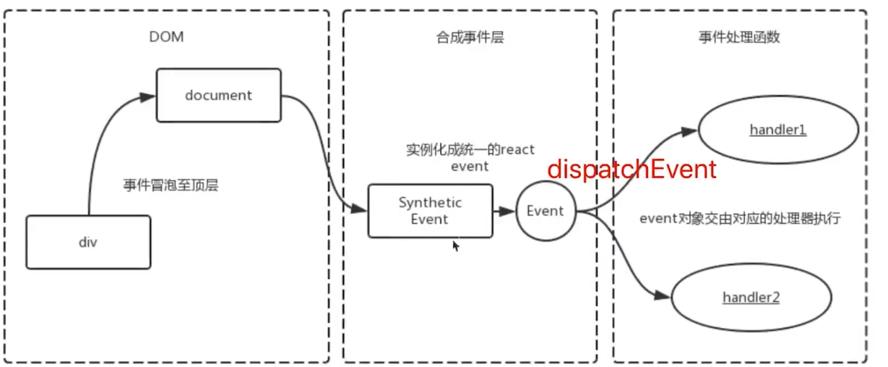
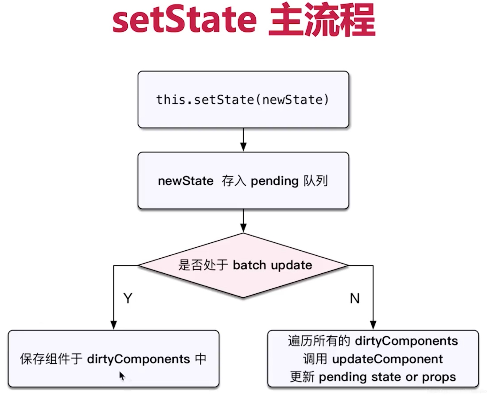

 # Interview-React-Principle React 原理

[[toc]]


## React 16版本


## React 原理

- 函数式编程
- Vdom 和diff
- JSX 本质
- 合成事件
- setState batchUpdate
- 组件渲染过程
- 前端路由


## Vdom 和 diff算法

- h函数
- vnode数据结构
- patch 函数

```js
{
    tag: "div",
    props: {
        className: "container",
        id: "div1"
    },
    children: [
        {
            tag: "p",
            children: "vdom"
        },
        {
            tag: "ul",
            props: { style: "font-size: 20px"},
            children：[
                {
                  tag: "li",
                  children: "a"  
                }] 
        }
    ]
}

```

- diff
  - 只比较同级，不跨级比较
  - tag不相同，则直接删除重建，不再深度比较
  - tag和key相同，两者都相同，则认为是相同节点，不再深度比较


## React 合成事件

- 所有事件挂载到document  最新挂载到root上面
- event不是原生的，是SyntheticEvent 合成事件对象

- 更好兼容跨平台
- 挂载到顶层，减少内存消耗
- 方便事件的统一管理



## setState 和 batchUpdate 批量更新

- setState 主流程
- batchUpdate 机制
- transaction 事务机制

::: details
setState 异步或者同步取决于 batchUpdate 的判断 isBatchingUpdates 

- setState
  -  异步: 事件回调，useEffect 回调       同步: setTimeout setInterval flushSync() 包裹的 setState
  -  合并对象形式(Object.assign)    不合并 函数形式
:::


::: details
- batchUpdate
  -  可以出发批量更新 事件处理函数、useEffect 回调、useMemo 和 useCallback 等 React 内部上下文中
  -   setTimeout、Promise 异步代码中
:::




## React 事务机制

::: details
1111
:::


## 组件渲染和更新的过程

::: details
- 组件渲染过程
  - props state
  - render生成vnode
  - patch(elem,vnode)

- 组件更新过程
  - setState(new State) ------- dirtyComponents 可能有子组件
  - render() 生成newVnode
  - patch(vnode, newVode)
:::


## React Fiber如何优化性能

::: danger
React Fiber出现的背景
- JS是单线程，且和DOM渲染公用一个线程
- 当组件足够复杂的时候，组件更新时候计算和渲染都压力大
- 同时再有DOM操作需求(动画、鼠标拖拽) 卡顿
:::


::: details
分为两个阶段：
- reconciliation 阶段 --- 执行diff算法，纯js计算 进行任务拆分 分级任务 window.requestIdleCallback 
- commit 阶段  ----- 将diff 结果渲染DOM  (无法拆分)

:::
