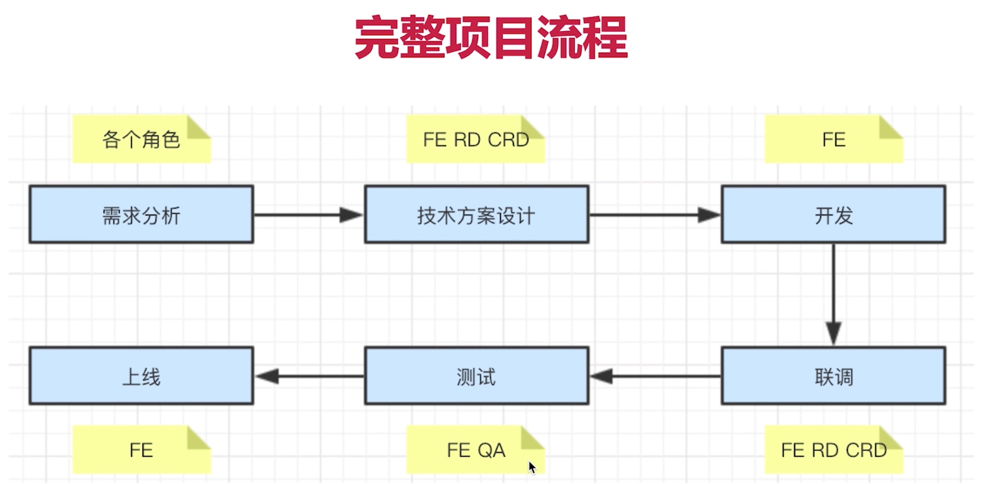

# 前端面试

## 项目流程

- 需求分析
  - 了解背景
  - 质疑需求是否合理
  - 需求是否闭环
  - 开发难度如何
  - 需求排期
- 技术方案设计
  - 求简 不要过度设计
  - 产出文档
  - 找准设计重点
  - 组内评审
  - 和rd crd沟通确认
  - 会议结论
- 开发
  - 如何反馈排期
  - 计算工作量
  - 符合开发规范
  - 写出开发文档
  - 及时单元测试
  - mock api
  - code review
- 联调
  - 和rd crd 技术联调
  - UE 确定视觉效果
  - PM确定产品功能
- 测试
  - 提测发邮件，抄送项目组
  - 测试问题详细记录
- 上线
  - 上线之后及时通知QA回归测试
  - 上线之后及时同步给PM和项目组
  - 如果有问题，及时回滚，先止损，再排查问题

- 补充
  - 临时加需求 (走需求变更流程 -- 重新评估排期)

### 项目角色

- PM 产品经理
- UE 视觉设计师
- FE 前端开发
- RD 后端开发
- QA 测试
- OP 运维
- PMO 项目管理
- CRD 移动端开发

### 项目流程开发

